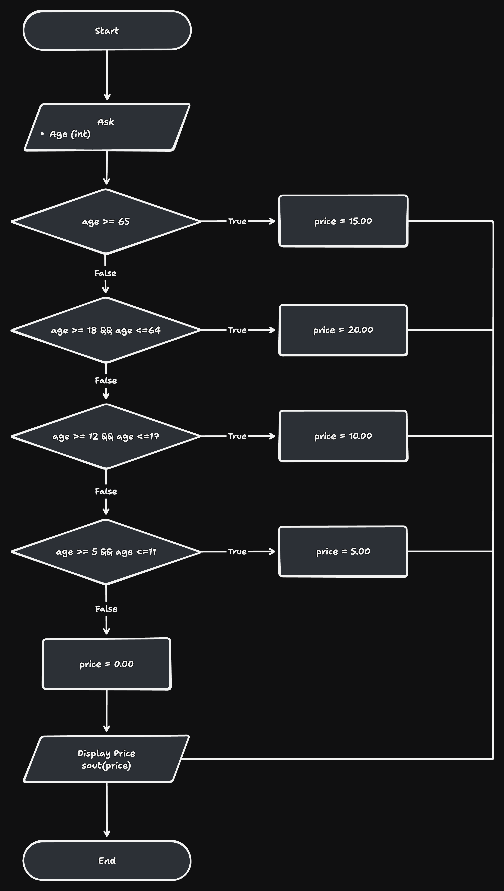

# Exercise 1

Use conditional logic to determine the admission price for a visitor based on their age.

## Problem Overview

-   Prompt the user for an integer age.
-   Determine the ticket price using the age brackets in the flowchart.
-   Display the price formatted with two decimal places (e.g., "15.00").

Age to price mapping:

| Age range    | Price |
| ------------ | ----- |
| 65 and older | 15.00 |
| 18 – 64      | 20.00 |
| 12 – 17      | 10.00 |
| 5 – 11       | 5.00  |
| Under 5      | 0.00  |
