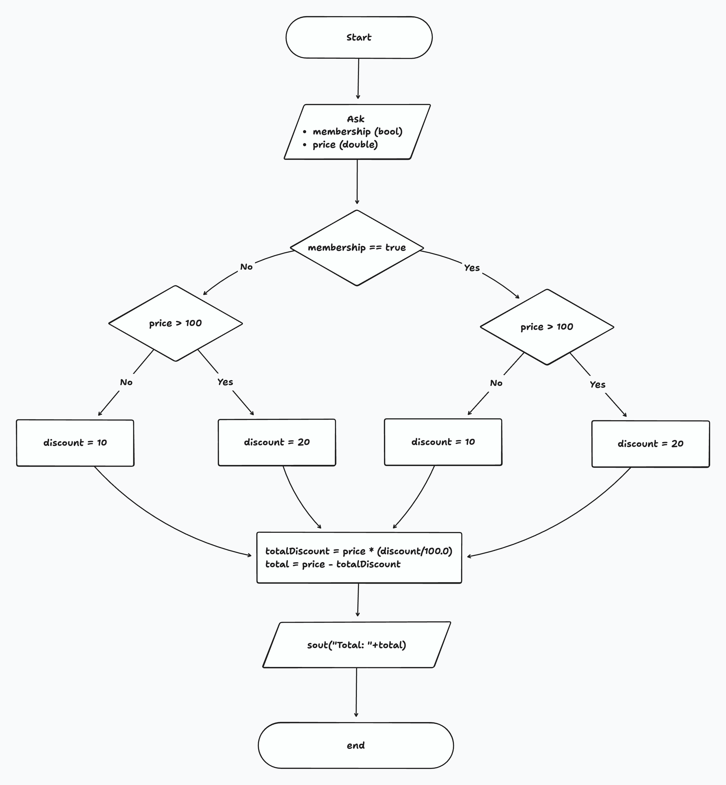

# If / Else-If / Else Refresher

A traditional `if` statement runs code when its condition is `true`. Adding an `else if` lets you check the next condition only if the earlier ones failed, so exactly one matching branch executes. The final `else` block catches every remaining case, guaranteeing a defined outcome.

Use this ladder when you need to test several related conditions and want just one result path.
